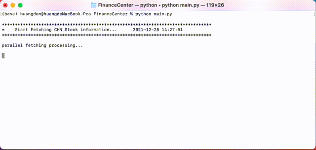
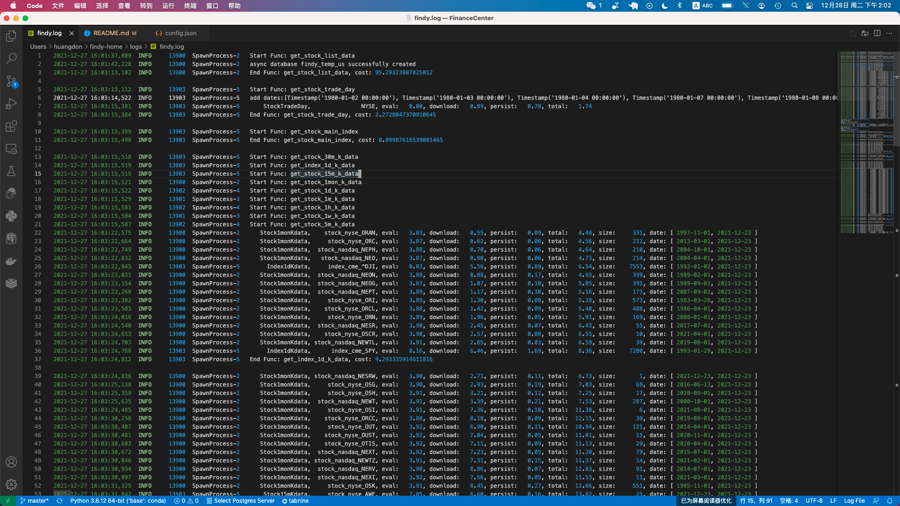
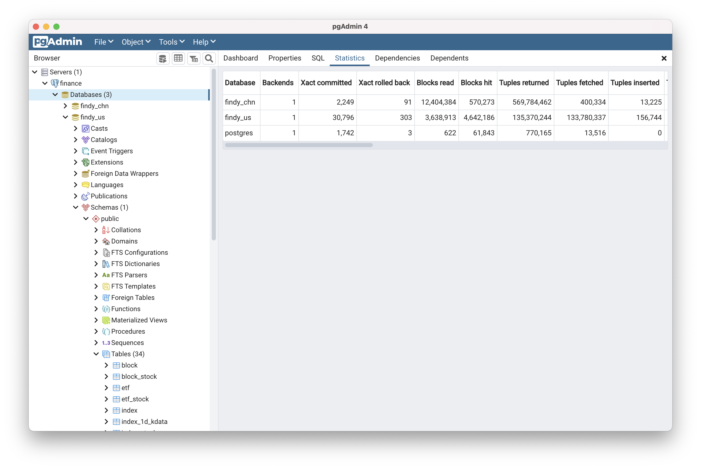

# Financial Center：Gathering open financial data and store in Relational Database
[](https://www.python.org/downloads/release/python-385/)
[]()
[]()
[]() 

<br>

## Overview

### Running Shot
<p align="left"></p>

### Logging Shot
<p align="left"></p>

### Database Shot
<p align="left"></p>

## Installation guide

The FinDy installation consists of setting up the following components:

1.  Packages / Dependencies
2.  Database
3.  Redis

### 1. Packages / Dependencies

Command line tools

```
xcode-select --install #xcode command line tools
```

Homebrew

```
ruby -e "$(curl -fsSL https://raw.githubusercontent.com/Homebrew/install/master/install)"
brew install git cmake pkg-config openssl
brew link openssl --force
```


### 2. Database

FinDy recommends using a PostgreSQL database. But you can use MySQL too, see [MySQL setup guide](database_mysql.md).

```
brew install postgresql
ln -sfv /usr/local/opt/postgresql/*.plist ~/Library/LaunchAgents
launchctl load ~/Library/LaunchAgents/homebrew.mxcl.postgresql.plist
```

Login to PostgreSQL

```
psql -d postgres
```

Create a user for FinDy.

```
CREATE USER xxx;
```

Create the FinDy production database & grant all privileges on database

```
CREATE DATABASE findy OWNER xxx;
```

Quit the database session

```
\q
```

Try connecting to the new database with the new user

```
sudo -u git -H psql -d findy
```

### 3. Redis

```
brew install redis
ln -sfv /usr/local/opt/redis/*.plist ~/Library/LaunchAgents
```

Redis config is located in `/usr/local/etc/redis.conf`. Make a copy:

```
cp /usr/local/etc/redis.conf /usr/local/etc/redis.conf.orig
```

Disable Redis listening on TCP by setting 'port' to 0

```
sed 's/^port .*/port 0/' /usr/local/etc/redis.conf.orig | sudo tee /usr/local/etc/redis.conf
```

Edit file (`nano /usr/local/etc/redis.conf`) and uncomment:

```
unixsocket /tmp/redis.sock
unixsocketperm 777
```

Start Redis

```
launchctl load ~/Library/LaunchAgents/homebrew.mxcl.redis.plist
```


## Configure FinDy Settings
> Default (`config.json`) setting
```
{
  "version": "0.0.2",

  "debug": 0,
  "processes": 1,
  "batch_size": 10000,
  
  "db_name": "findy",
  "db_host": "192.168.1.133",
  "db_port": "15432",
  "db_user": "postgres",
  "db_pass": "123",

  "redis_pass": "",
  "kafka": "localhost:9092",

  "jq_username": "",
  "jq_password": "",

  "tushare_token": "",

  "trade_host": "127.0.0.1",
  "trade_port": "11111",
  "trade_socket_port": "33333",
  "trade_socket_key": "",

  "http_proxy": "127.0.0.1:1087",
  "https_proxy": "127.0.0.1:1087",
  "smtp_host": "smtpdm.aliyun.com",
  "smtp_port": "80",
  "email_username": "",
  "email_password": "",
  "wechat_app_id": "",
  "wechat_app_secrect": "",
  "wechat_agent_id": ""
}
```

change database host address to following setting if you install your database locally:
```
  "db_host": "127.0.0.1",
  "db_port": "5432",
```

set database user and password to your custom settings:
```
  "db_user": "xxx",
  "db_pass": "xxx",
```

chinese stock market user are required to obtain joinquant and tushare authentication. <br>
[JoinQuant](https://www.joinquant.com/) <br>
[TuShare](https://tushare.pro/register) <br>

## Improvement:
### (25 Dec 2021)
* asyncDB branch add async sqlalchemy ORM  support
* many bugfix

### (01 Mar 2021)
* database session decoupling
* entity provider removed
* database querying speed boost up
* asyncio logic framework support (implementations requires rewrite request logic)
* multiprocessing logic rewrite, use processes to replace pool
* add proxy pool support
* add baostock thrid party source support

### (16 Sep 2020):
* Switch Sql to Postgresql, which allow remote database access support, separate fetching and analysis models to two individal project(see [FinanceAnalysis](https://github.com/doncat99/FinanceAnalysis) project for more detail).
* Centralized http request interface，add Session and retry logic (Rxpy may be involved to rewrite request model pretty soon).
* multiprocessing is involved to boost up request speed.
* request progress display support.
* ~~auto joinquant account switching~~ (banned)
* log to console -> log to file.
* US stock market data support.
* global timezone support.
* tiny bug fix.


## Todo


## Docker Usage

### Docker Execute
```
docker-compose stop; docker-compose rm -f ; docker-compose build --no-cache
docker-compose up -d
```

查看日志
```
docker-compose logs -f 
```