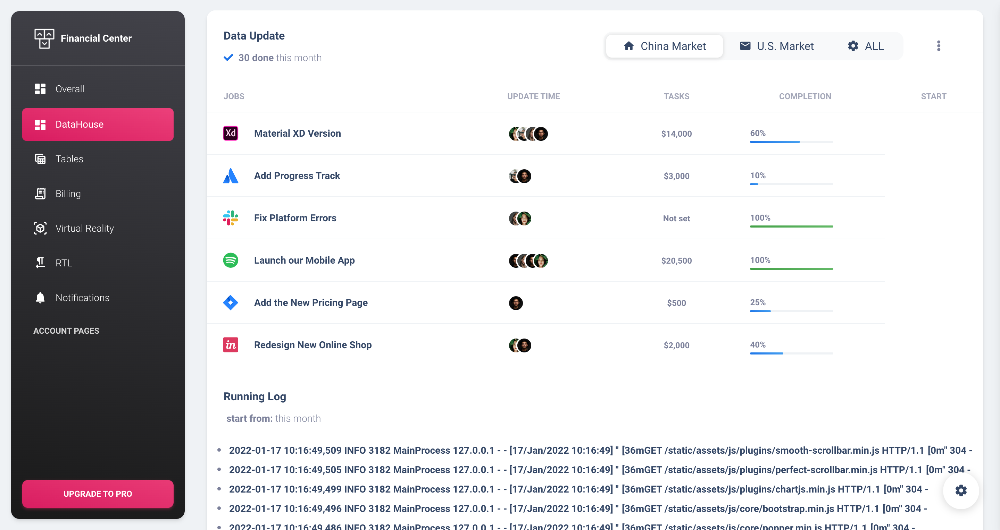
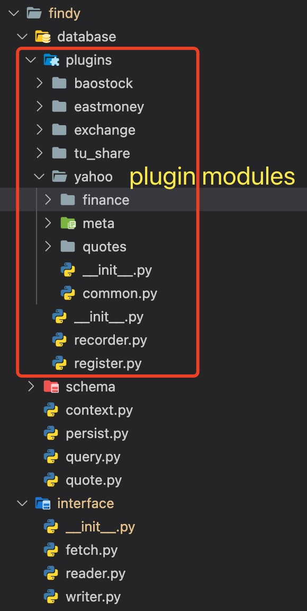

Financial Center: open financial data framework
===============================================
[](https://www.python.org/downloads/release/python-385/)
[]()
[]()
[]() 

<br><br>

- [Financial Center: open financial data framework](#financial-center-open-financial-data-framework)
- [Overview](#overview)
    - [Running Shot](#running-shot)
    - [Logging Shot](#logging-shot)
    - [Database Shot](#database-shot)
    - [Flask Demo Shot](#flask-demo-shot)
- [Description](#description)
- [Installation guide](#installation-guide)
    - [1. Packages / Dependencies](#1-packages--dependencies)
    - [2. Database](#2-database)
    - [3. Redis](#3-redis)
    - [4. Kafka](#4-kafka)
    - [5. Pip Packages](#5-pip-packages)
- [Configure FinDy Settings](#configure-findy-settings)
- [Updates:](#updates)
    - [(25 Dec 2021)](#25-dec-2021)
    - [(01 Mar 2021)](#01-mar-2021)
    - [(16 Sep 2020):](#16-sep-2020)
- [How to use](#how-to-use)
    - [Fetch data](#fetch-data)
    - [Read data](#read-data)
- [Docker Usage](#docker-usage)
    - [Docker Execute](#docker-execute)
    - [View Log](#view-log)
- [To Do](#to-do)
<br>

# Overview

### Running Shot
<p align="left"></p>

### Logging Shot
<p align="left"></p>

### Database Shot
<p align="left"></p>

### Flask Demo Shot
<p align="left"></p>

# Description

Based on registry framework, project can easily compat various of thrid-party data sources. <br>
Below shows all data sources that project already supported.

<table width="40%">
  <tr >
    <td colspan="3" align="center">Third Party Data Sources Support Table</td>
  </tr>
  <tr>
    <th>China Market</th>
    <th>US Market</th>
    <th>HK Market</th>
  </tr>
  <tr>
    <td>BaoStock</td>
    <td colspan="2" align="center">Yahoo</td>
  </tr>
  <tr>
    <td>JoinQuant</td>
    <td>alpaca</td>
    <td></td>
  </tr>
  <tr>
    <td>Tushare</td>
    <td></td>
    <td></td>
  </tr>
  <tr>
    <td>EastMoney</td>
    <td></td>
    <td></td>
  </tr>
</table>

To add more third party data sources, please reference (`findy/database/plugins/***`) modules for modification.
<p align="left"></p><br>


# Installation guide
The FinDy installation consists of setting up the following components:

### 1. Packages / Dependencies

Command line tools

```shell
xcode-select --install #xcode command line tools
```

Homebrew

```shell
/bin/bash -c "$(curl -fsSL https://gitee.com/ineo6/homebrew-install/raw/master/install.sh)"
echo 'eval "$(/opt/homebrew/bin/brew shellenv)"' >> /Users/huangdon/.zprofile
eval "$(/opt/homebrew/bin/brew shellenv)"

brew install git cmake pkg-config openssl
brew link openssl --force
```


### 2. Database

FinDy recommends using a PostgreSQL database. But you can use MySQL too, see [MySQL setup guide](database_mysql.md).<br>
```shell
# Install package
brew install postgres
postgres -V

# Start PostgreSQL server
pg_ctl -D /usr/local/var/postgres start
#Or you can start the PostgreSQL server and have it start up at login automatically
brew services start postgresql

# Stop PostgreSQL server
pg_ctl -D /usr/local/var/postgres stop
#To make it stop starting up automatically at login
brew services stop postgresql

# Login to PostgreSQL
psql -U XXX(superuser role) -d postgres

# Create a user for FinDy
CREATE USER postgres with NOSUPERUSER CREATEDB CREATEROLE INHERIT LOGIN;

# Create the FinDy production database & grant all privileges on database
CREATE DATABASE findy OWNER postgres;

# Quit the database session
\q

# Try connecting to the new database with the new user
sudo -u git -H psql -d findy

# tuning postgres (optional)
cpan -i DBD::Pg
cd pgtune
chmod +x postgresqltuner.pl
./pg_tune.sh
```

### 3. Redis

```shell
brew install redis
ln -sfv /usr/local/opt/redis/*.plist ~/Library/LaunchAgents
```

Redis config is located in `/usr/local/etc/redis.conf`. Make a copy:

```shell
cp /usr/local/etc/redis.conf /usr/local/etc/redis.conf.orig
```

Disable Redis listening on TCP by setting 'port' to 0

```shell
sed 's/^port .*/port 0/' /usr/local/etc/redis.conf.orig | sudo tee /usr/local/etc/redis.conf
```

Edit file (`nano /usr/local/etc/redis.conf`) and uncomment:

```shell
unixsocket /tmp/redis.sock
unixsocketperm 777
```

Start Redis

```shell
launchctl load ~/Library/LaunchAgents/homebrew.mxcl.redis.plist
```


### 4. Kafka
```shell
# Install package
brew install zookeeper
brew install kafka

modify file /opt/homebrew/etc/kafka/server.properties, active line listeners=PLAINTEXT://:9092 as below:

############################# Socket Server Settings #############################
# The address the socket server listens on. It will get the value returned from 
# java.net.InetAddress.getCanonicalHostName() if not configured.
#   FORMAT:
#     listeners = listener_name://host_name:port
#   EXAMPLE:
#     listeners = PLAINTEXT://your.host.name:9092
listeners=PLAINTEXT://localhost:9092

# Start kafka server
brew services start zookeeper
brew services start kafka

pip install kafka_python
```


### 5. Pip Packages
```shell
pip install -r requirements_mac_arm64.txt

# optional, generate requirement.txt file from project imports
$ pipreqs ./ --force
```

<br>

# Configure FinDy Settings
Default (`config.json`) setting
```json
{
  "version": "0.0.2",

  "debug": 0,
  "processes": 1,
  "batch_size": 10000,
  
  "db_name": "findy",
  "db_host": "192.168.1.133",
  "db_port": "15432",
  "db_user": "",
  "db_pass": "",

  "redis_pass": "",
  "kafka": "localhost:9092",

  "jq_username": "",
  "jq_password": "",

  "tushare_token": "",

  "trade_host": "127.0.0.1",
  "trade_port": "11111",
  "trade_socket_port": "33333",
  "trade_socket_key": "",

  "http_proxy": "127.0.0.1:1087",
  "https_proxy": "127.0.0.1:1087",
  "smtp_host": "smtpdm.aliyun.com",
  "smtp_port": "80",
  "email_username": "",
  "email_password": "",
  "wechat_app_id": "",
  "wechat_app_secrect": "",
  "wechat_agent_id": ""
}
```

change database host address to following setting if you install your database locally:
```json
  "db_host": "127.0.0.1",
  "db_port": "5432",
```

set database user and password to your custom settings:
```json
  "db_user": "xxx",
  "db_pass": "xxx",
```

chinese stock market user are required to obtain joinquant and tushare authentication. <br>
>   [JoinQuant](https://www.joinquant.com/) <br>
>   [TuShare](https://tushare.pro/register) <br>
<br>

# Updates:
### (25 Dec 2021)
* rewrite yahoo finance lib (yfinance) to support aiohttp requests
* remove proxy pool
* add wechat notify (see utils/notify.py for more details)
* dev/async_db branch: add async sqlalchemy ORM
* many bugfix

### (01 Mar 2021)
* database session decoupling
* entity provider removed
* database querying speed boost up
* asyncio logic framework (implementations requires rewrite request logic)
* multiprocessing logic rewrite, use processes to replace pool
* add proxy pool (see [proxy_pool](https://github.com/doncat99/proxy_pool))
* add baostock thrid party data source

### (16 Sep 2020):
* Switch Sql to Postgresql, which allow remote database access, separate fetching and analysis models to two individal project(see [FinanceAnalysis](https://github.com/doncat99/FinanceAnalysis) project for more detail).
* Centralized http request interface，add Session and retry logic (Rxpy may be involved to rewrite request model pretty soon).
* multiprocessing is involved to boost up request speed.
* request progress display.
* ~~auto joinquant account switching~~ (banned)
* log to console -> log to file.
* US stock market data.
* global timezone support.
* tiny bug fix.

<br>

# How to use
### Fetch data
```python
from findy.interface import Region
from findy.interface.fetch import fetching

fetching(Region.CHN)  # Region.US
```

### Read data
```python
from datetime import datetime, timedelta

from findy.interface import Region, Provider, EntityType, SP_500_TICKER
from findy.interface.reader import DataReader
from findy.database.schema.meta.stock_meta import Stock, StockDetail
from findy.database.schema.quotes.stock.stock_1d_kdata import Stock1dKdata
from findy.database.schema.register import get_entity_schema_by_type
from findy.database.context import get_db_session
from findy.database.quote import get_entities


end = datetime.now()
start = end - timedelta(days=365)

entity_schema = get_entity_schema_by_type(EntityType.StockDetail)
db_session = get_db_session(Region.US, Provider.Yahoo, entity_schema)
entities, column_names = get_entities(
        region=Region.US,
        provider=Provider.Yahoo,
        entity_schema=entity_schema,
        db_session=db_session,
        codes=SP_500_TICKER,
        columns=[StockDetail.code],
        filters=[StockDetail.market_cap > 10_000_000_000])

codes_cap = [entity.code for entity in entities]

stock_reader = DataReader(region=Region.US,
                          provider=Provider.Yahoo,
                          data_schema=Stock1dKdata,
                          entity_schema=Stock,
                          codes=codes_cap,
                          start_timestamp=start.strftime('%Y-%m-%d'),
                          end_timestamp=end.strftime('%Y-%m-%d'))

stock_reader.load_data()
df = stock_reader.data_df.reset_index(drop=True)
gb = df.groupby('code', sort=False)
stocks = [(code, gb.get_group(code)) for code in gb.groups]
```
<br>

# Docker Usage
### Docker Execute
```shell
docker-compose stop; docker-compose rm -f ; docker-compose build --no-cache
docker-compose up -d
```

### View Log
```shell
docker-compose logs -f 
```

# To Do
1. rewrite vendor/baostock package to support async logic
2. add more 3th-party data source packages
3. dev/async_db branch optimization